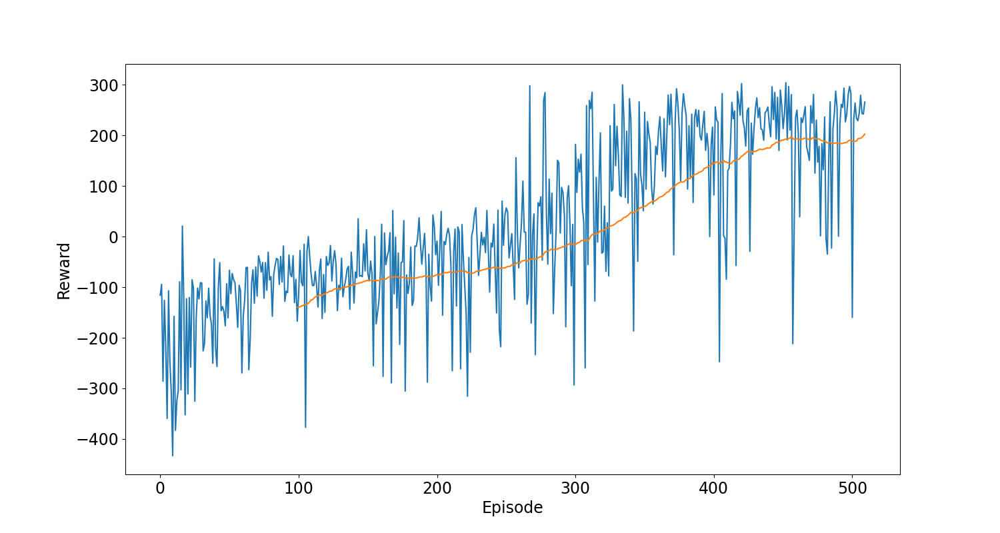
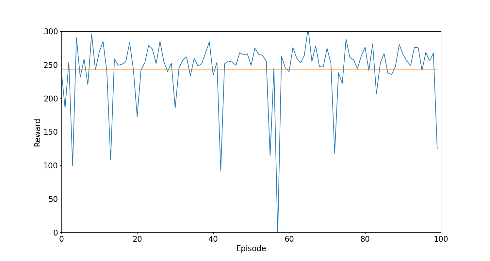

# RL-LunarLander
Reinforcemnt learning 

gym kütüphanesinden LunarLander için bir DQN tabanlı çalışma

```
pip install gym

pip install stable-baselines3

pip install atari_py
```
Eğitim sonucunun grafiksel gösterimi:
Figure 1: Reward for each training episode.png


test sonucunun grafiksel gösterimi:



test aşamasından bir görüntü


